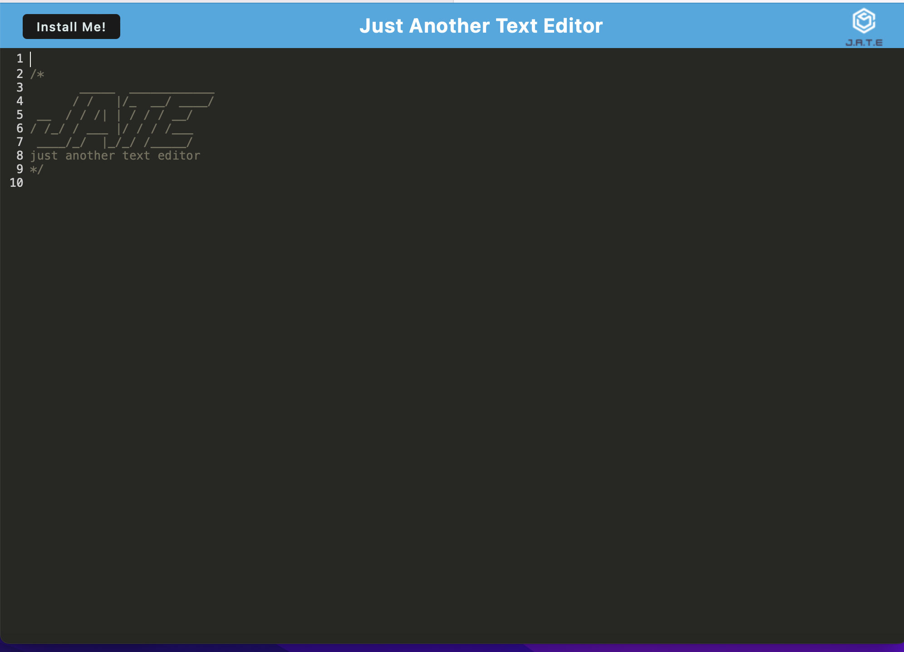

# ReadME Generator

  

```
## Table of Contents
```

- [Description](#description)
- [intallation instructions](#intallation)
- [usage information](#usage)
  
  - [images](#images)
- [contribution guidelines](#contribution)
- [test instructions](#test)
- [Questions](#Questions)
- [License](#License)
  
  ## Description
  
  This is a read me generator to create descritive and quick read me for future projects.
  
  ## intallation
  
  Install this appilcation by cloning it off of git hub and running in the terminal using node js
  
  ## images
  
  
  
  ## usage
  
  Run node index.js in the deveopler folder in the intergrated terminal in VScode.
  
  ## contribution
  
  to contribute create a pull request to this gitHub repo.
  
  ## test
  
  no test have been run for this project.
  
  ## Questions
  
  Contact Me At:
  
  [jessemaun21@gmail.com:](jessemaun21@gmail.com);
  
  Git Hub:
  [Jmaun22:](link)
  
  email me
  
  ## License
  
  MIT
  
  MIT License
  
  Copyright (c) [2022] [Jesse Maun]
  
  Permission is hereby granted, free of charge, to any person obtaining a copy
  of this software and associated documentation files (the "Software"), to deal
  in the Software without restriction, including without limitation the rights
  to use, copy, modify, merge, publish, distribute, sublicense, and/or sell
  copies of the Software, and to permit persons to whom the Software is
  furnished to do so, subject to the following conditions:
  
  The above copyright notice and this permission notice shall be included in all
  copies or substantial portions of the Software.
  
  THE SOFTWARE IS PROVIDED "AS IS", WITHOUT WARRANTY OF ANY KIND, EXPRESS OR
  IMPLIED, INCLUDING BUT NOT LIMITED TO THE WARRANTIES OF MERCHANTABILITY,
  FITNESS FOR A PARTICULAR PURPOSE AND NONINFRINGEMENT. IN NO EVENT SHALL THE
  AUTHORS OR COPYRIGHT HOLDERS BE LIABLE FOR ANY CLAIM, DAMAGES OR OTHER
  LIABILITY, WHETHER IN AN ACTION OF CONTRACT, TORT OR OTHERWISE, ARISING FROM,
  OUT OF OR IN CONNECTION WITH THE SOFTWARE OR THE USE OR OTHER DEALINGS IN THE
  SOFTWARE.
  
  (MIT)[https://choosealicense.com/licenses/mit/]
  

